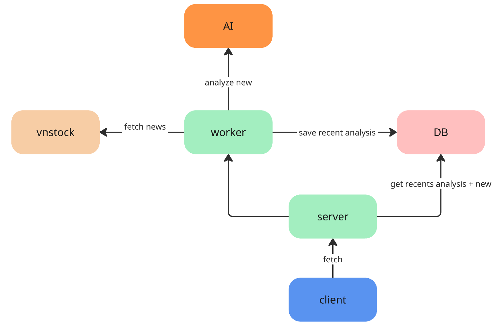

# Lazy Investor

A comprehensive stock analysis dashboard offering real-time market data and AI-powered news sentiment analysis for the Vietnamese stock market.

## System Architecture

The diagram below shows the high-level data flow between the client, server, worker, and external services.



## Project Overview

Lazy Investor aims to simplify investment decisions by aggregating financial data and providing automated analysis. It combines quantitative market data with qualitative news analysis using Perplexity AI to assess the impact of news on stock prices.

## Features

- **Market Data**: Real-time stock prices, intraday data, and company information via the `vnstock` library.
- **News Aggregation**: Automatically fetches related news from multiple sources (vnstock, Google News).
- **AI Analysis**: Uses Perplexity AI (Sonar model) to analyze news articles.
  - Determines relevance to stock price.
  - Classifies sentiment (Bullish, Bearish, Neutral).
  - Generates executive summaries (TLDR).
  - Scores the potential impact on stock valuation (1-10).
- **Market Summary**: Generates a consolidated market sentiment report based on recent news.

## Tech Stack

### Backend
- **Framework**: FastAPI (Python)
- **Data Source**: vnstock (Vietnamese stock market data)
- **AI Integration**: Perplexity AI API
- **Web Scraping**: newspaper3k, feedparser
- **Database**: SQLite / SQLAlchemy

### Frontend
- **Framework**: React (Vite)
- **Styling**: Tailwind CSS, shadcn/ui
- **State Management**: TanStack Query (React Query)

## Setup Instructions

### Prerequisites
- Python 3.10+
- Node.js 18+
- Perplexity API Key

### Backend Setup

1. Navigate to the server directory:
   ```bash
   cd server
   ```

2. Create and activate a virtual environment:
   ```bash
   python -m venv venv
   source venv/bin/activate  # On Windows: venv\Scripts\activate
   ```

3. Install dependencies:
   ```bash
   pip install -r requirements.txt
   ```

4. Configure environment variables:
   Create a `.env` file in the `server` directory:
   ```env
   # server/.env
   PERPLEXITY_API_KEY=your_pplx_api_key_here
   ```

5. Run the server:
   ```bash
   # Development mode
   ./uvicorn.sh
   # OR
   python -m uvicorn app.main:app --reload
   ```
   The API will be available at `http://localhost:8000`. API Docs at `http://localhost:8000/docs`.

### Frontend Setup

1. Navigate to the client directory:
   ```bash
   cd client
   ```

2. Install dependencies:
   ```bash
   npm install
   ```

3. Run the development server:
   ```bash
   npm run dev
   ```
   The application will run at `http://localhost:5173`.

## Usage & Testing

### Testing the Analysis Service
You can run a standalone script to test the AI analysis pipeline without starting the full server:

```bash
# From the root directory
python server/scripts/test_analysis_service.py
```
This script analyzes a sample ticker (e.g., HPG) and outputs the JSON result to `server/scripts/analysis_result_HPG.json`.

## Project Structure

```
.
├── client/                 # React Frontend
│   ├── src/
│   │   ├── api/            # API integration
│   │   ├── components/     # React components
│   │   └── pages/          # Application routes
├── server/                 # FastAPI Backend
│   ├── app/
│   │   ├── api/            # Route controllers
│   │   ├── services/       # Business logic (AI, News, Stocks)
│   │   └── models/         # Pydantic schemas & DB models
│   └── scripts/            # Utility and test scripts
└── script/                 # Root level scripts
```

## Contributing
Pull requests are welcome. For major changes, please open an issue first to discuss what you would like to change.

## License
[MIT](https://choosealicense.com/licenses/mit/)
